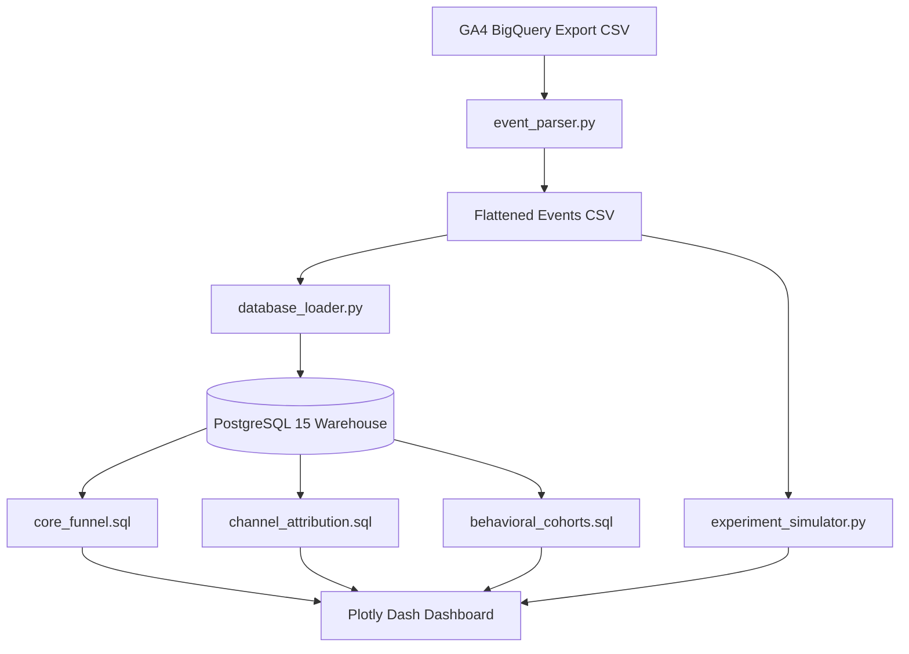
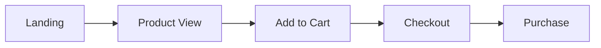
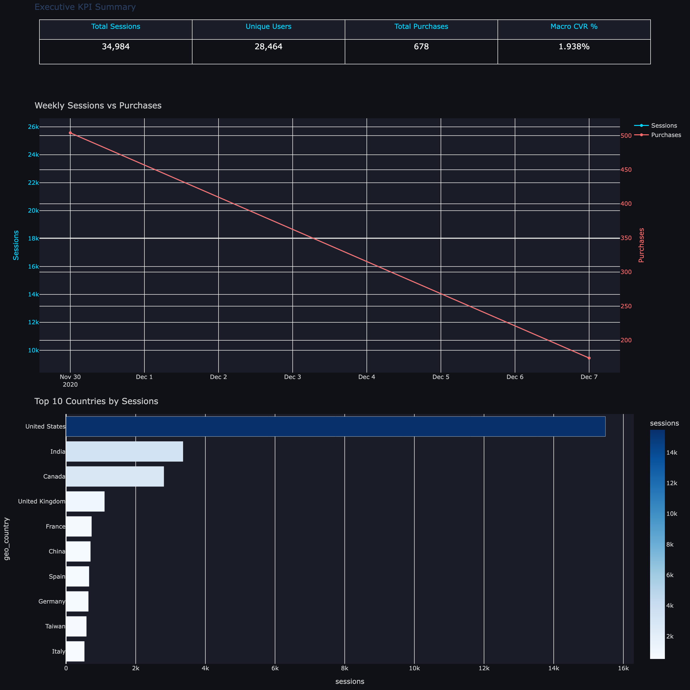
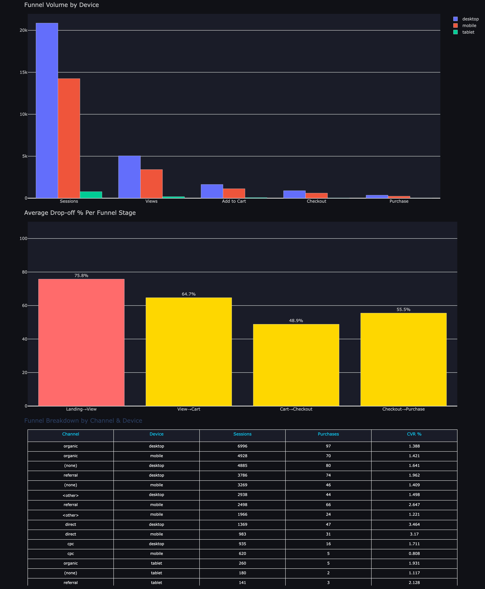
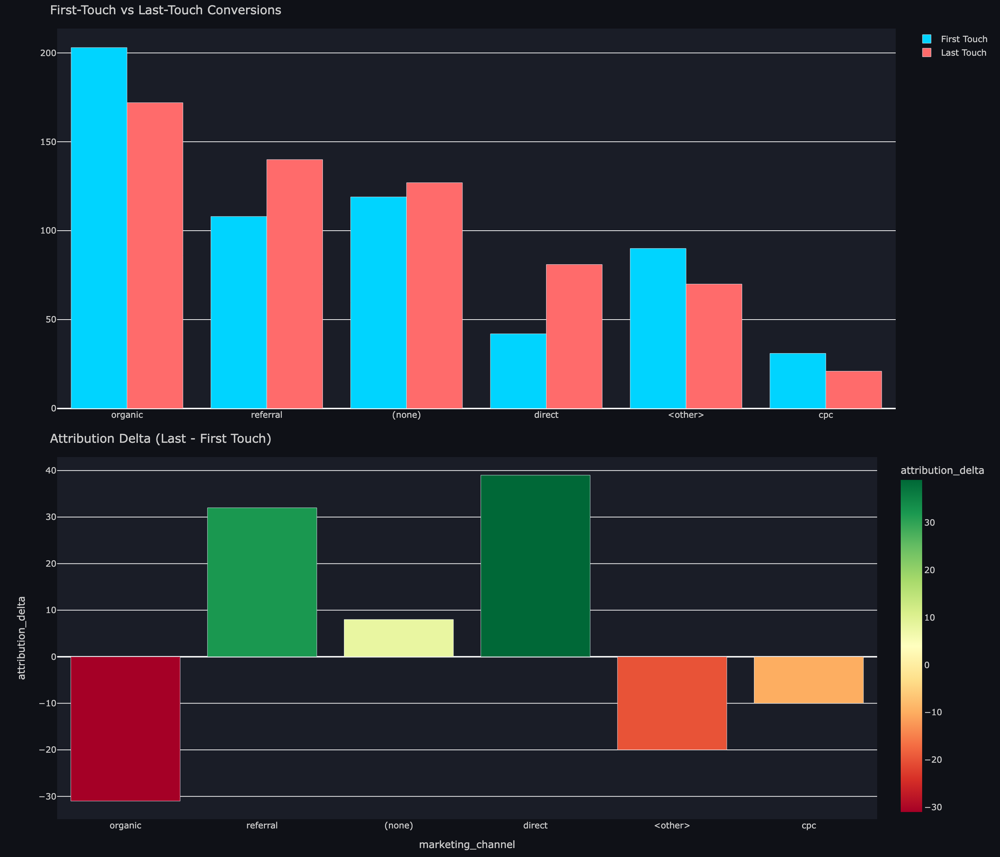
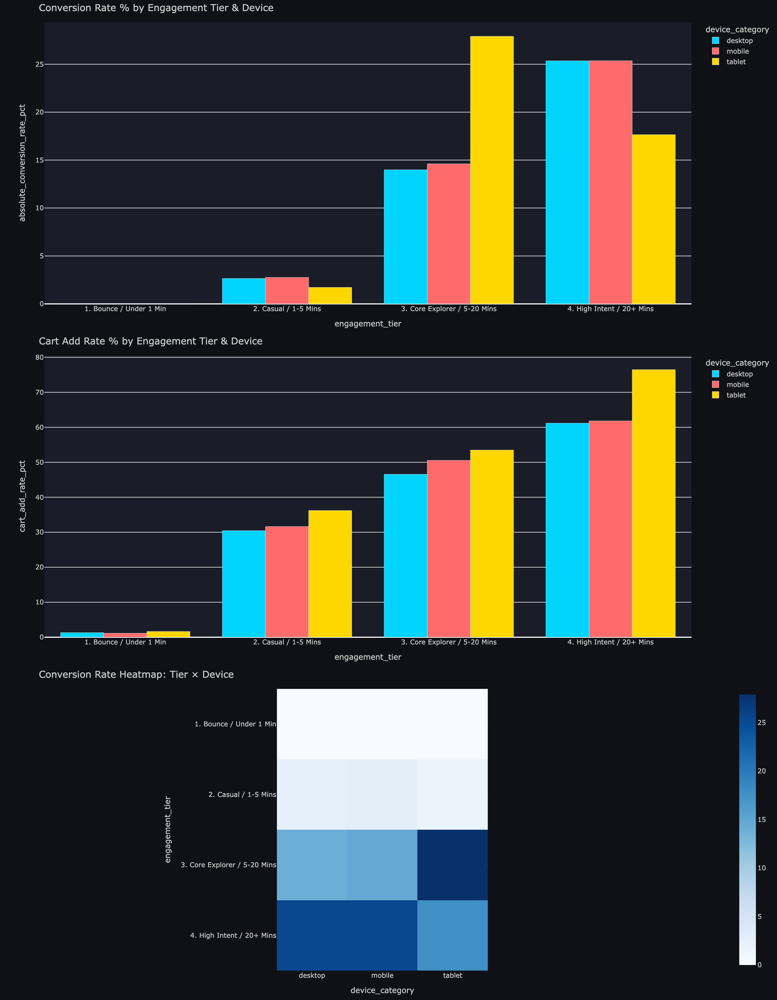
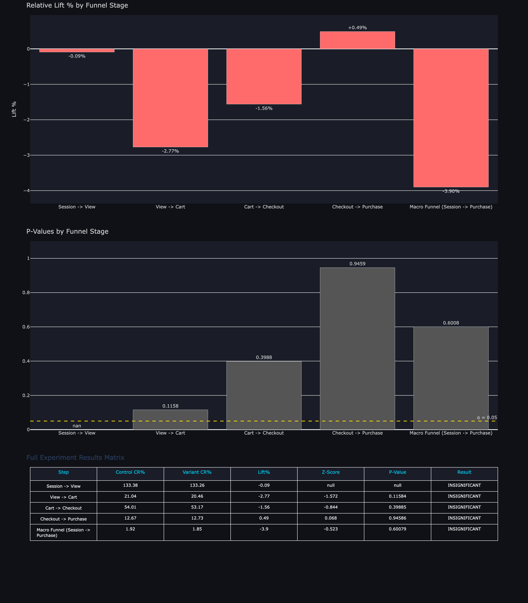

# Growth Funnel Intelligence Engine
Conversion Funnel Analytics · Channel Attribution · Behavioral Cohort Analysis · A/B Experiment Framework

An end-to-end growth analytics platform built on real GA4 event-stream data that reconstructs the full user journey from session start to purchase, diagnoses conversion leakage at every funnel stage, attributes revenue to acquisition channels, and runs statistically rigorous A/B experiments — delivered through an interactive multi-page dashboard.

---

## Project Value

This project turns raw event data into a practical growth analytics system with reusable SQL assets, reliable event parsing, and executive-ready conversion insights.

It is especially strong for:
- Data Analyst.
- Growth Analyst.
- Product Analyst.
- Marketing Analyst.
- Analytics Engineer.

---

## Business Problem

Growth and product teams need answers to four critical questions:

- Where exactly are users dropping off between landing and purchase?
- Which acquisition channels bring the highest-converting users?
- How does user engagement time correlate with conversion probability?
- Does a product change actually move the needle, or is the lift just noise?

Without event-level analytics, teams make channel and product decisions based on aggregate metrics that hide the real drop-off story.

---

## Dataset

**Google Analytics 4 — Google Merchandise Store BigQuery Export**

Real GA4 event streams from a live e-commerce store, exported from BigQuery and processed through a custom ETL pipeline.

| Metric | Value |
|---|---:|
| Total Sessions | 34,984 |
| Unique Users | 28,464 |
| Total Purchases | 678 |
| Macro Conversion Rate | 1.938% |
| Acquisition Channels | 6 (organic, referral, direct, cpc, none, other) |
| Devices | Desktop · Mobile · Tablet |
| Geography | 10+ countries (US dominant) |
| Observation Window | Nov 30 – Dec 7, 2020 |

---

## System Architecture



---

## Funnel Flow



---

## Solution Modules

### Module 1 — Executive KPI Summary



Top-line growth metrics surfaced as an executive scorecard:

- 34,984 total sessions across a 7-day window.
- 28,464 unique users tracked end-to-end.
- 678 realized purchases.
- 1.938% macro conversion rate from session to purchase.
- Weekly sessions vs. purchases trend with a dual-axis chart.
- Top 10 countries by session volume, with the US driving 15K+ sessions.

### Module 2 — Funnel Leakage Analysis



Reconstructed the full 5-stage checkout funnel from raw event data using SQL window functions and session-level aggregation.

**Drop-off rates at each stage:**

| Stage | Drop-off % |
|---|---:|
| Landing → Product View | 75.8% |
| Product View → Add to Cart | 64.7% |
| Add to Cart → Checkout | 48.9% |
| Checkout → Purchase | 55.5% |

**Key insight:** The largest leakage occurs at landing to product view. Only 24.2% of sessions ever reach a product page, making this the primary opportunity for content and UX optimization.

**Funnel breakdown by channel and device:**

| Channel | Device | Sessions | Purchases | CVR % |
|---|---|---:|---:|---:|
| direct | desktop | 1,369 | 47 | 3.464% |
| direct | mobile | 983 | 31 | 3.170% |
| referral | mobile | 2,498 | 66 | 2.647% |
| organic | desktop | 6,996 | 97 | 1.388% |
| cpc | mobile | 620 | 5 | 0.808% |

Direct traffic converts at 2.3x the rate of organic, indicating high-intent returning users.

### Module 3 — Channel Attribution



Compared first-touch vs. last-touch attribution across all acquisition channels using SQL window functions over the full user event history.

**Key findings:**

- Organic dominates first-touch, making it the strongest top-of-funnel awareness driver.
- Referral shows positive attribution delta and gains credit as a closing channel.
- Direct shows the highest last-touch delta and acts as the primary conversion closer.
- Organic loses first-touch credit at the end of the journey, confirming it often initiates sessions rather than closes them.
- CPC underperforms on both metrics and is the lowest ROI channel.

Attribution delta reveals which channels assist versus close, directly informing budget allocation decisions.

### Module 4 — Behavioral Cohort Analysis



Segmented all sessions into engagement tiers based on session duration, then analyzed conversion and cart-add rates across device types.

**Engagement tiers:**
- Bounce / Under 1 Min — near-zero conversion.
- Casual / 1–5 Mins — 2–3% conversion.
- Core Explorer / 5–20 Mins — 14–27% conversion.
- High Intent / 20+ Mins — 25% conversion across all devices.

**Key findings:**

- Sessions lasting 5+ minutes convert at 13x the rate of bounce sessions.
- Tablet users in the Core Explorer tier convert at 27%, the highest of any device/tier combination.
- High Intent sessions show near-equal conversion across desktop and mobile, suggesting mobile UX is not a barrier for engaged users.
- Cart-add rate reaches 75%+ for tablet High Intent sessions, the strongest purchase signal.

### Module 5 — A/B Experiment Framework



Implemented deterministic A/B variant assignment using SHA-256 hashing on user IDs with a 50/50 control and variant split, then applied two-proportion Z-test inference across funnel stages.

**Experiment results:**

| Funnel Stage | Control CR% | Variant CR% | Lift % | P-Value | Result |
|---|---:|---:|---:|---:|---|
| Session → View | 133.38% | 133.26% | -0.09% | null | INSIGNIFICANT |
| View → Cart | 21.04% | 20.46% | -2.77% | 0.116 | INSIGNIFICANT |
| Cart → Checkout | 54.01% | 53.17% | -1.56% | 0.399 | INSIGNIFICANT |
| Checkout → Purchase | 12.67% | 12.73% | +0.49% | 0.946 | INSIGNIFICANT |
| Macro (Session → Purchase) | 1.92% | 1.85% | -3.90% | 0.601 | INSIGNIFICANT |

**Interpretation:** No statistically significant difference was detected at any funnel stage. The correct conclusion is not to ship. This demonstrates the guardrail value of statistical testing by preventing teams from acting on noise.

---

## Tech Stack

| Layer | Technology |
|---|---|
| Raw Data | GA4 BigQuery Export (CSV) |
| ETL & Parsing | Python · pandas · psycopg2 |
| Experiment Engine | SciPy · NumPy · Z-test inference |
| Database | PostgreSQL 15 (Docker) |
| Analytics | SQL (CTEs, Window Functions, FIRST_VALUE, NULLIF) |
| Dashboard | Plotly Dash · Dash Bootstrap Components |
| Orchestration | Docker · Docker Compose |

---

## Repository Structure

```text
growth-funnel-intelligence/
├── dashboard/
│   └── app.py
├── data/
│   ├── raw/
│   │   └── ga4_events_dump.csv
│   ├── transformed/
│   │   └── flattened_events.csv
│   └── models/
│       └── experiment_results.csv
├── sql/
│   ├── schema.sql
│   ├── core_funnel.sql
│   ├── channel_attribution.sql
│   └── behavioral_cohorts.sql
├── src/
│   ├── event_parser.py
│   ├── database_loader.py
│   └── experiment_simulator.py
├── reports/
├── docker-compose.yml
└── README.md
```

---

## How to Run

```bash
git clone <repo-url>
cd growth-funnel-intelligence

docker compose up -d

docker exec -i growth_funnel_postgres psql \
  -U postgres -d growth_funnel_db < sql/schema.sql

python src/event_parser.py
python src/database_loader.py
python src/experiment_simulator.py

docker exec -i growth_funnel_postgres psql \
  -U postgres -d growth_funnel_db < sql/core_funnel.sql

docker exec -i growth_funnel_postgres psql \
  -U postgres -d growth_funnel_db < sql/channel_attribution.sql

docker exec -i growth_funnel_postgres psql \
  -U postgres -d growth_funnel_db < sql/behavioral_cohorts.sql

python dashboard/app.py
```

Open:
- http://127.0.0.1:8050

---

## Key Metrics

- 34,984 sessions analyzed across a 7-day GA4 event window.
- 28,464 unique users tracked from acquisition to purchase.
- 75.8% drop-off identified at the landing to product view stage.
- 3.46% CVR for direct desktop, the highest converting segment.
- 13x conversion rate difference between High Intent and Bounce sessions.
- Organic drives top-of-funnel awareness; Direct closes conversions.
- The A/B framework correctly identifies insignificant results and prevents false shipping decisions.

---

## Reports

The following PNG outputs are included in `reports/` and referenced with relative paths for GitHub rendering.

### Executive KPI Summary


### Funnel Leakage Analysis


### Channel Attribution


### Behavioral Cohort Analysis


### A/B Experiment Framework


---

## What This Demonstrates

- Event-level funnel reconstruction from raw GA4 streams using SQL sessionization.
- Multi-touch attribution modeling with first-touch vs. last-touch comparison using window functions.
- Behavioral segmentation by engagement duration and device, revealing conversion intent signals.
- Statistically rigorous A/B testing with Z-test inference, p-value interpretation, and guardrail logic.
- Production ETL pipeline with batch loading, schema validation, and idempotent truncate-reload.
- End-to-end analytics workflow from raw event export to executive dashboard.